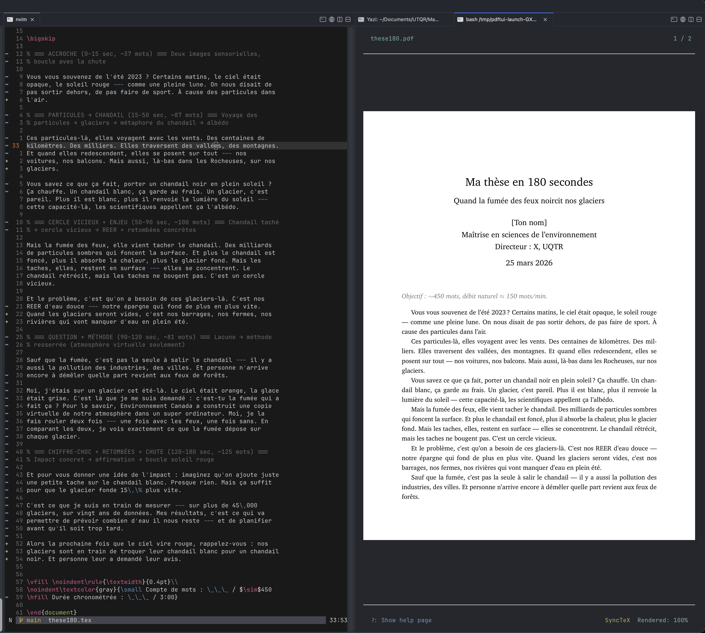

# `pdftui`

A terminal-based PDF viewer with SyncTeX support.

Designed to be performant, very responsive, and work well with even very large PDFs. Built with [`ratatui`](https://github.com/ratatui-org/ratatui).

## Features

- SyncTeX support (forward/inverse search with Neovim)
- Asynchronous rendering
- Searching
- Hot reloading
- Responsive details about rendering/search progress
- Reactive layout

## Installation

1. Get the rust toolchain from [rustup.rs](https://rustup.rs)
2. Run `cargo install --git https://github.com/tofunori/pdftui.git`

If you want to use this with `epub`s or `cbz`s, add `--features epub` or `--features cbz` to the command line (or `--features cbz,epub` for both)

## To Build

First, install the system dependencies — generally `libfontconfig` and `clang`. On Linux these show up as `libfontconfig1-devel` or `libfontconfig-dev` and `clang` in your package manager.

If a dependency is missing, the build will fail and tell you what's needed.

1. Get the rust toolchain from [rustup.rs](https://rustup.rs)
2. Clone the repo and `cd` into it
3. Run `cargo build --release`

The binary will be at `./target/release/pdftui`.

## Can I contribute?

Yeah, sure. Please do. All contributions will be treated as licensed under MPL-2.0.
